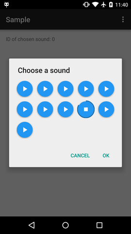
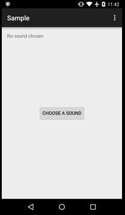

##SoundChooser


 Android Circular floating action button with intergrated progress indicator ring

##Demo:

[Sample apk](raw/sample.apk)




##Adding to Project
[  ](https://bintray.com/jordond/maven/SoundChooser/_latestVersion)

 Add my maven repo:
 ```groovy
repositories {
    maven {
        url  "http://dl.bintray.com/jordond/maven" 
    }
}
 ```
 
 Add the following dependencies
  ```groovy
dependencies {
    compile 'ca.hoogit:fabbutton:1.2.0'
    compile 'ca.hoogit:soundchooser:1.0.3'
}
 ```

##Usage

-	See sample app for basic implementation
- Create a new instance of SoundChooserDialog
```java
  SoundChooserDialog.newInstance("A Title",
              int[] arrayOfSounds, int buttonColor, int numOfColumns, buttonSize);
```

##Example
- Creating an instance, then show the dialog
```java
SoundChooserDialog dialog = SoundChooserDialog.newInstance("Choose a sound",
                soundFiles, Color.parseColor("#2196F3"), 5, SoundChooserDialog.SIZE_SMALL);
                
dialog.show(getFragmentManager(), "aTag");
```
The `int[] arrayOfSounds` is an array of Resource ID's for your sound clips, in the sample 
I grab all the ID's from the `res/raw` folder like so.
```java
Field[] fields = R.raw.class.getFields();
int[] sounds = new int[fields.length];
try {
    for (int count = 0; count < fields.length; count++) {
        sounds[count] = fields[count].getInt(fields[count]);
    }
} catch (IllegalAccessException e) {
    e.printStackTrace();
}
```

You can change the type of audio stream android will pick
```java
dialog.setAudioStreamType(AudioManager.STREAM_MUSIC);
dialog.setAudioStreamType(AudioManager.STREAM_NOTIFICATION); // default
dialog.setAudioStreamType(AudioManager.STREAM_ALARM);
// ...etc
```
A list of stream types and explanation can be found [here](http://developer.android.com/reference/android/media/AudioManager.html)

Add a listener to the dialog
```java
dialog.setOnOptionChosen(new SoundChooserDialog.OnOptionChosen() {});
```
##Themes are now supported
You can now set a custom theme style for the dialog.
```xml
<style name="DialogThemeSample" parent="Theme.AppCompat.Dialog.Alert">
    <item name="android:textColor">#F00</item>
    <item name="android:shadowColor">#000000</item>
    <item name="android:shadowDx">2</item>
    <item name="android:shadowDy">2</item>
    <item name="android:shadowRadius">2</item>
</style>
```

```java
dialog.setTheme(R.style.DialogThemeSample);
```

##License

SoundChooser
Copyright (C) 2015  Jordon de Hoog

This program is free software; you can redistribute it and/or modify
it under the terms of the GNU General Public License as published by
the Free Software Foundation; either version 2 of the License, or
(at your option) any later version.

This program is distributed in the hope that it will be useful,
but WITHOUT ANY WARRANTY; without even the implied warranty of
MERCHANTABILITY or FITNESS FOR A PARTICULAR PURPOSE.  See the
GNU General Public License for more details.

You should have received a copy of the GNU General Public License along
with this program; if not, write to the Free Software Foundation, Inc.,
51 Franklin Street, Fifth Floor, Boston, MA 02110-1301 USA.
